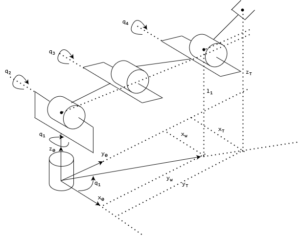
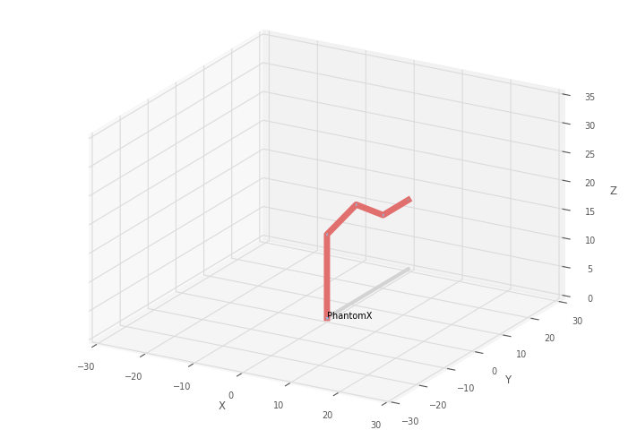
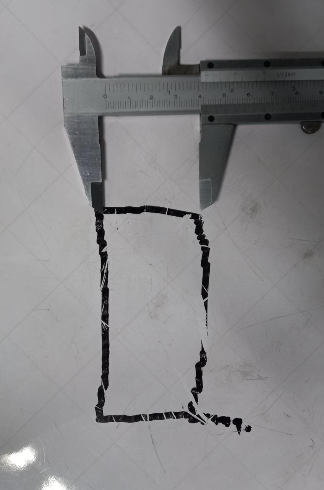
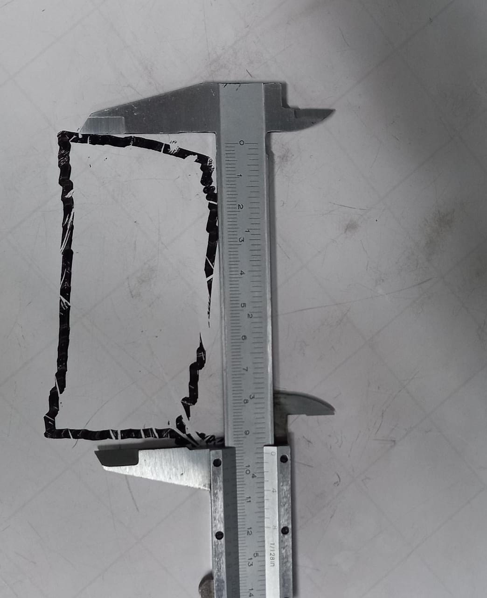

# RoboticsLab5 Cinemática Inversa - Phantom X - ROS
## Por: Sebastian Campiño Figueroa, Julián Felipe Luna Castro y Diego Fernando Mejía Hernández

Development of the fifth robotics laboratory, focused on using ROS to manipulate the Phantom X Pincher trough inverse kinematics.


Este repositorio contiene las memorias y programas desarrollados durante la quinta práctica de laboratorio de la materia Robótica. Esta práctica tiene como objetivo afianzar los conocimientos de cinemática inversa mediante el uso de los robots Phantom X Pincher, determinando el modelo cinemático inverso del robot, generando trayectorias a partir de este modelo e implementando el modelo cinématico en MATLAB o Python (en este caso Python). 

## Requerimientos

* Ubuntu 20.04 LTS o version compatible
ROS Noetic
* Espacio de trabajo para catkin correctamente configurado.
* Paquetes de Dynamixel Workbench. Tomado de: https://github.com/fegonzalez7/rob_unal_clase3
* Paquete del robot Phantom X. Tomado de: https://github.com/felipeg17/px_robot.
* MATLAB 2015b o superior.
* Robotics toolbox de mathworks.
* Python 3.x.x
* Toolbox de robótica de Peter Corke.
* Marcadores Borrables
* Actitud y ganas de aprender.

## Instalación del toolbox de Peter Corke

Primero instalamos la version mas reciente del toolbox de robotica de Peter Corke para python siguiendo las instrucciones en su repositorio ([que se encuentra aqui](https://github.com/petercorke/robotics-toolbox-python.git)), corriendo los siguientes comandos en bash:


    git clone https://github.com/petercorke/robotics-toolbox-python.git
    git clone https://github.com/jhavl/swift
    git clone https://github.com/jhavl/spatialgeometry
    git clone https://github.com/petercorke/spatialmath-python.git
    cd robotics-toolbox-python
    pip3 install -e .
    cd ../swift
    pip3 install -e .
    cd ../spatialgeometry
    pip3 install -e .
    cd ../spatialmath-python
    pip3 install -e .


## Modelo de cinemática inversa 

Primero
* MTH de la herramienta

Sabemos la posición y orientación del efector final que se puede dar en una MTH de la herramienta como la siguiente:


$$ T= \begin{bmatrix}
nx & ox & ax & xc\\ 
ny & oy & ay & yc\\ 
nz & oz & az & zc\\ 
0 & 0 & 0 & 1
\end{bmatrix}$$

Teniendo la posición en términos de xc, yc y zc, es fácil encontrar el valor de la primera articulación, y posteriormente determinar el modelo de cinemática inversa.

En general debemos determinar la configuración articular de un manipulador, dadas la posición y orientación del efector final respecto a la base. Este problema puede resolverse mediante métodos geométricos, algebraicos o numéricos. En el caso particular del robot Phantom X el cual posee 4 GDL, el enfoque más práctico es combinar el método geométrico con el desacople de muñeca.


El modelo geométrico construido se muestra a continuación.

<p align="center"></p>

y en general usando algunas relaciones geométricas tenemos:

$$ q1= tan \left( \frac{y_T}{x_T}\right)$$

$$ \theta_{3}= acos \left( \frac{r²+h²-l_2 ²-l_3 ²}{2l_2 l_3}\right)$$

$$ \beta_{3}= atan2 \left( \frac{l_3 \sin{\theta_{3}}}{l_2 + l_3\cos{\theta_{3}}}\right)$$

$$ \alpha = atan2 \left(\frac{h}{r}\right)$$

$$ \theta_{2} = \alpha - \beta $$


## Métodos disponibles del toolbox para determinar la cinemática inversa de un manipulador.

Existen multiples comandos del toolbox de Peter Corke que funcionan para determinar la cinematica inversa de un manipulador, los cuales listamos a continuacion:

* **SerialLink.ikine6s** : Calcula la cinematica inversa de forma analitica para robots de 6 grados de libertad con muñeca esferica. Permite hallar una solucion especifica segun los parametros de configuracion dados.
* **SerialLink.ikine3** : Calcula la cinematica inversa para robots con 3 grados de libertad sin muñeca. Es igual a ikine6s pero sin la muñeca esferica.
* **SerialLink.ikine** : Calcula la cinematica inversa por metodos numericos. Es una solucion general y suele preferirse usar otras soluciones especificas para un caso dado. No funciona bien para robots con 4 o 5 grados de libertad.
* **SerialLink.ikunc** : Calcula la cinematica inversa por metodos numericos, sin tener en cuenta los limites de las articulaciones. Requiere el Toolbox de Optimizacion, pues utiliza la funcion fminunc.
* **SerialLink.ikcon** : Calcula la cinematica inversa por metodos numericos, teniendo en cuenta los limites de las articulaciones. Requiere el Toolbox de Optimizacion, pues utiliza la funcion fmincon.
* **SerialLink.ikine_sym** : Calcula la cinemática inversa de forma simbolica, con multiples celdas dependiendo del numero de configuraciones diferentes que se puedan tener para la solucion. Requiere el Symbolic Toolbox de Matlab y es codigo experimental.


## Modelo de cinemática inversa del manipulador en Python:

A continuación se presenta nuestra solución para el problema de cinemática inversa en Python para el robot Phantom X con configuración codo arriba.


```

def invKinPhantomX(T):
    """
    Calcula los valores q de la cinematica inversa para el robot Phantom X
    en configuracion codo arriba.
    T: Matriz de transformacion Homogenea
    Salida:
    q: Lista de las valores para las 4 articulaciones en grados. 
    """
    q = [0.0, 0.0, 0.0, 0.0]
    # l = [4.5, 10.5, 10.5, 7.5]
    l = np.array([14.5, 10.7, 10.7, 9])
    try:
        #Desacople de muñeca
        posW = T[0:3, 3] - l[3]*T[0:3, 2]
    
        #Solucion para q1 en rad
        q[0] = math.atan2(T[1,3], T[0,3]) 

        #Solución de mecanismo 2R para q2 y q3
        h = round(posW[2] - l[0],3)
        r = round(math.sqrt(posW[0]**2 + posW[1]**2),3)

        #Solucion para q3
        q[2]= math.acos(round((r**2+h**2-l[1]**2-l[2]**2)/(2*l[1]*l[2]), 3))*(-1)
        #Solucion para q2 usando q3
        q[1] = math.atan2(h,r) + math.atan2(l[2]*math.sin(-q[2]), l[1]+l[2]*math.cos(-q[2]))
        #Se resta el offset de la articulacion
        q[1] = q[1] - math.pi/2   

        #Solucion para q4
        phi = math.atan2(T[2,2], math.sqrt(T[0,2]**2 +T[1,2]**2)) - math.pi/2
        q[3] = phi - q[1] - q[2]
        # Rp = rotz(q[0]).transpose() @ np.array(T[0:3, 0:3])
        # pitch = math.atan2(float(Rp[2,0]),float(Rp[0,0]))
        # q[3] = float(pitch) - q[1] - q[2]
        # while q[3] > (7/6)*math.pi:
        #     q[3] -= 2*math.pi
        q = [value*180/math.pi for value in q]
        return q
        
    except ValueError:
        print("Esta posicion no puede ser alcanzada, o por lo menos no en esta configuracion.")

```


Se realizarón algunas simulaciones haciendo uso del Toolbox de Peter Corke para algunas posiciones, esto junto con las MTH nos permitó comprobar que el modelo programado de cinemática inversa para el Phantom X funcionaba de manera adecuada.

<p align="center"></p>

Se realizó un script para realizar distintas figuras haciendo uso de la cinemática inversa (esta parte se mostró previamente), se realizó una figura geométrica (Primer video), para este video el marcador es ubicado en el efector de manera manual y se realiza la figura primero realizando una aproximación al punto inicial. También se realizó dos arcos y una estrella, en este caso el marcador se ubica en una base, en esta posición es recogido por el efector final, se posiciona el manipulador para hacer el acercamiento, hace el acercamiento, realiza la estrella o los dos arcos según el caso y se devuelve a la posición de home.

## Video de la producción de trayectorias desarrolladas a partir de Python con el modelo de cinemática inversa

Los videos de a continuación presentan en general el funcionamiento de generación de trayectorias de nuestro script en el laboratorio con el robot Pincher Phantom X.

<video width="640" height="480" controls align="center">
  <source src="./Videos/Video1LAB5.mp4" type="video/mp4">
</video>

* Video 1 (GH) *
https://github.com/juflunaca/RoboticsLab5/blob/ee813425c0f81438fae122e540a658a51742dbe0/Video/Video1LAB5.mp4

<video width="640" height="480" controls align="center">
  <source src="./Videos/Video1LAB5.mp4" type="video/mp4">
</video>

* Video 2 (GH) *
* https://github.com/juflunaca/RoboticsLab5/blob/ee813425c0f81438fae122e540a658a51742dbe0/Video/Video2LAB5.mp4

  
* Link videos (Drive) *
* https://drive.google.com/file/d/1rxtv4TgNXMGzV9egYUY8DD0z4AJMl3W3/view?usp=sharing
  
* https://drive.google.com/file/d/1A6r7T7L6PWKS3PDgmmBf_21xc8lh1qCH/view?usp=sharing

## Exactitud  y precisión

A continuación se muestra los resultados obtenidos a medir el rectángulo realizado por el manipualdor según la trayectoria y los via-points definidos en el script de python.

* Altura del cuadrilatero

Según lo definido inicialmente el la longitud de la "altura" de nuestro rectángulo debería ser de 4 cm, en este caso podemos ver a continuación que se obtiene una medida de aproximadamente 4.1mm, obteniendo el siguiente error:

$$\delta = | \frac{v_A-v_E}{v_E} |\cdot 100 \% $$
donde:


$v_A$ = Valor observado


$v_E$ = Valor Esperado


$\delta$ = Error porcentual

En este caso se obtiene un error del 2.5% o un error absoluto de +/- 1mm.

<p align="center"></p>


* Ancho del cuadrilatero


Según lo definido inicialmente el la longitud del "ancho" de nuestro rectángulo debería ser de 10 cm, en este caso podemos ver a continuación que se obtiene una medida de aproximadamente 9.51mm, obteniendo que en este caso el error es de 4.9% y +/-0.49mm de error absoluto.


<p align="center"></p>

Respecto a la precisión se seleccionó 30 via-points entre punto y punto, obteniendo el resultado mostrado en el video, como se evidencia los trazos no siguen completamente una trayectoria recta y se desvía ligeramente en algunos puntos, por lo que podríamos decir que la precisión obtenida fue baja debido a que entre punto y punto había un error presente lo suficientemente grande para desviar los trazos del manipualdor.

## Conclusiones

* La presición y exactitud del robot Phantom X es baja debido a que los movimientos son muy bruscos, incluso bajando el delta entre cada punto intermedio de una trayectoria no podemos obtener una trayectoria muy exacta o precisa, esto además se propaga debido a que varios robots del laboratorio tienen algo de libertad de rotación incluso estando energizados debido a que no están bien ajustados a los soportes.

* Una buena comprensión de la cinemática inversa nos permité hacer nuestra propia implementación del control del movimiento del robot, lo cual fue fundamental para implementar la solución de nuestra alicación.

